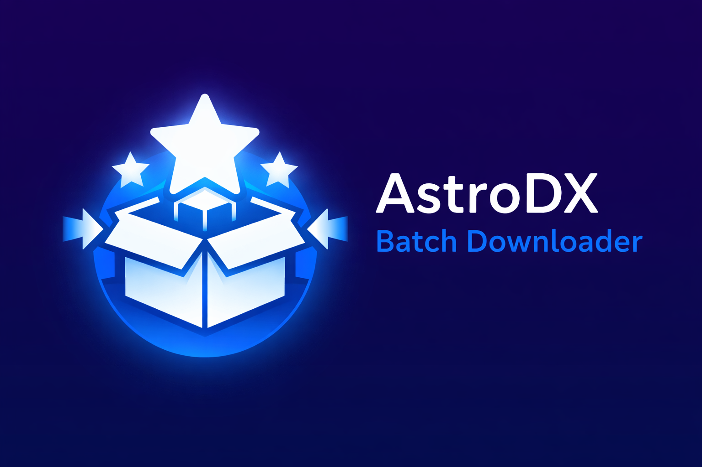

# AstroDX Batch Downloader



基于 Tauri + Rust 的本地谱面批量下载工具。本工具为 [AstroDX 谱面下载站](https://astrodx.milkbot.cn/)的非官方辅助工具，用于从下载站按索引文件批量下载谱面文件，并将其自动整合为整合包，以一次性导入到游戏中。

本工具的开发计划与下载站和 AstroDX 游戏本体均无关联，仅为分享我从下载站以自动化批量下载谱面的方法。

## 使用教程

参见 [docs/tutorial.md](docs/tutorial.md)。

## 平台支持

- [x] macOS arm64
- [x] Windows x64 / arm64
- [x] Linux x64 / arm64

**WIP**
- [ ] Android
- [ ] iOS

## 已实现功能

- 内置 `collections` 清单目录（35 份 `manifest.json`）
- 支持勾选多个清单并按 ID 去重下载
- 下载选项：
  - `下载不包含 BGA`（`nobga`）
  - `输出格式`（`.adx` / `.zip`）
- 下载完成后可选自动整合为单 `.adx`：
  - 仅处理本次新下载文件
- 任务状态：启动、进度、日志、失败项、取消
- 支持手动刷新外部 `collections` 目录（运行时 overlay）

## 技术栈

- Frontend: React + Vite + TypeScript
- Backend: Rust + Tauri

## 平台依赖

### Windows

- 依赖 Microsoft WebView2 Runtime（安装包会自动引导安装）

### Linux（Ubuntu/Debian 系）

```bash
sudo apt-get update
sudo apt-get install -y \
  libwebkit2gtk-4.1-dev \
  libappindicator3-dev \
  librsvg2-dev \
  patchelf \
  build-essential
```

## 开发运行

```bash
npm install --include=dev
npm run tauri dev
```

## 生产构建

```bash
npm run tauri build
```

## 关键接口（Tauri commands）

- `list_builtin_collections`
- `refresh_collections_from_dir`
- `start_download_task`
- `cancel_task`
- `get_task_state`

## 目录结构

- `collections/`：内置 manifest 快照
- `src/`：前端 UI
- `src-tauri/src/collections.rs`：manifest 解析与清单加载
- `src-tauri/src/downloader.rs`：下载任务与鉴权流程
- `src-tauri/src/bundler.rs`：自动整合
- `src-tauri/src/lib.rs`：Tauri 命令与任务状态管理
