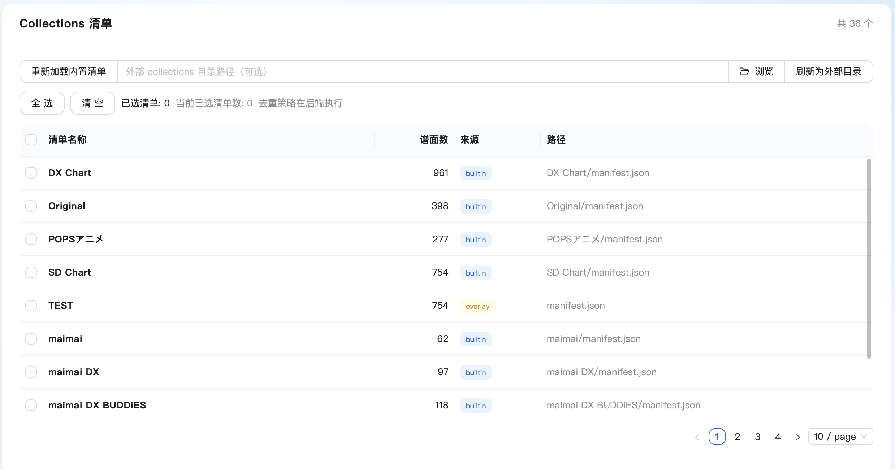
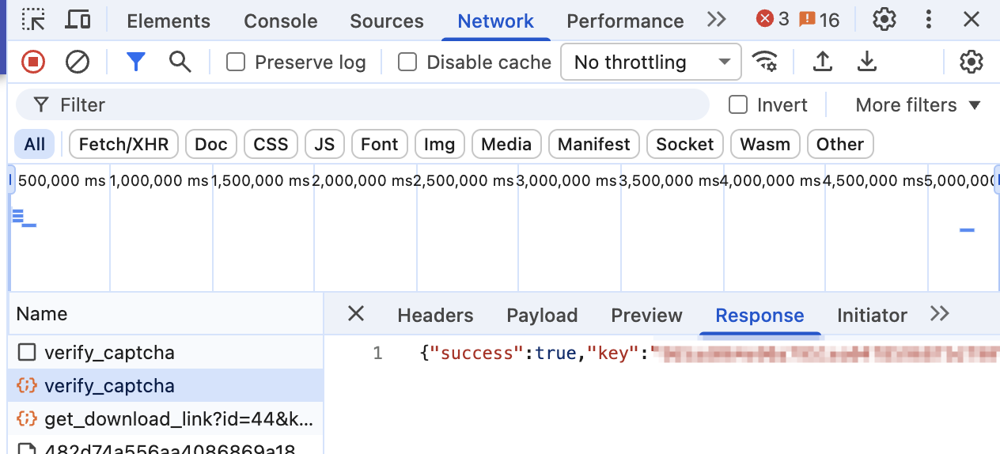
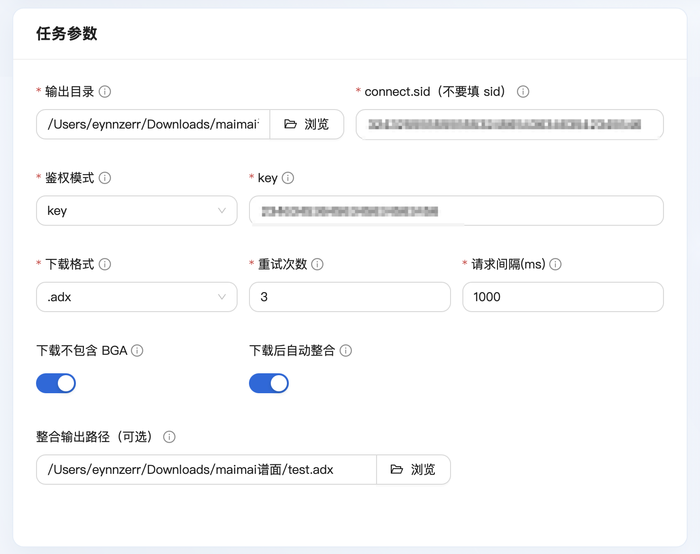
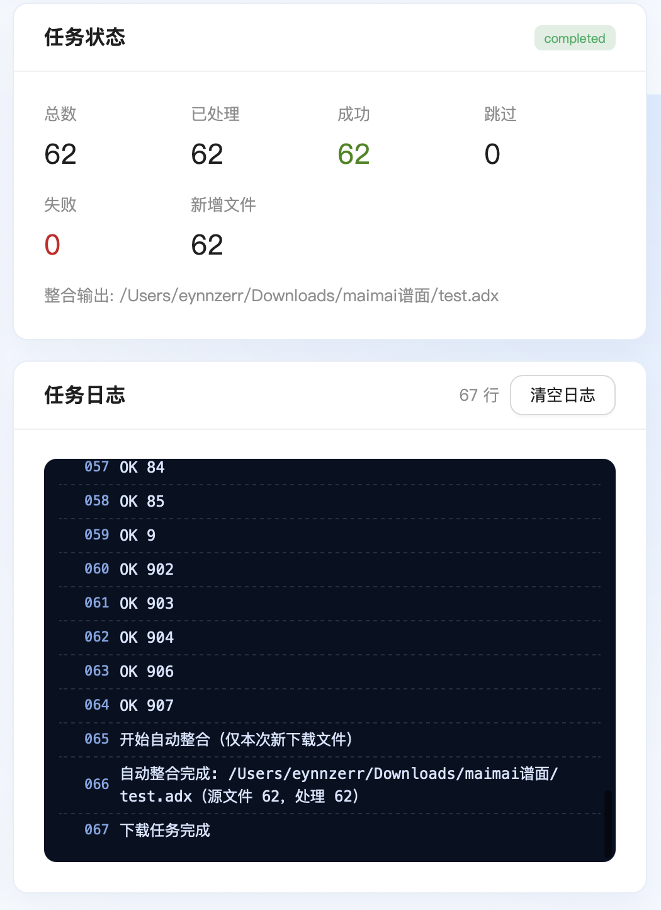

# AstroDX Batch Downloader 使用教程（基础版）

本文面向首次使用本工具的用户，介绍从准备到下载、再到整合包（聚合）的完整基础流程。

## 1. 先了解两个核心概念

### 1.1 什么是 collections

`collections` 可以理解为“清单目录”，是AstroDX游戏本体目录下的一个文件夹，内部又包含多个文件夹，与歌单名称同名（如niconicoボーカロイド）。文件夹内部只有一个文件：`manifest.json`，它代表一组谱面集合。AstroDX会读取这个文件，并自动为文件中的谱面建立合集分类；而本软件则直接利用此文件夹，读取这些清单来决定要从下载站下载哪些谱面。

在本工具中：

- 仓库自带一个内置 `collections/` 目录。
- 你也可以加载外部 `collections` 目录，用于导入你自己的清单，只要格式符合要求即可。

### 1.2 什么是 manifest.json

`manifest.json` 是使用`JSON`格式的清单文件，包含一组谱面的ID列表。本工具会读取其中的 `levelIds` 字段，把这些 ID 当作待下载谱面列表。

常见结构示例：

```json
{
  "name": "maimai DX PRiSM",
  "levelIds": ["12345", "23456", "34567"]
}
```

说明：

- `name`：清单名称（可选）。
- `levelIds`：谱面 ID 数组（必需，不能为空）。

### 1.3 如何导入外部 manifest.json 文件

本软件不是“单文件导入”，而是“导入外部 collections 目录”。做法如下：

1. 在界面顶部 `Collections 清单` 区域找到输入框 `外部 collections 目录路径（可选）`。
2. 点击 `浏览` 选择你的外部 `collections` 根目录。
3. 点击 `刷新为外部目录`。
4. 刷新成功后，表格中会出现外部清单（来源通常显示为 `overlay`）。

外部目录建议结构：

```text
your-collections/
  pack-a/
    manifest.json
  pack-b/
    manifest.json
```



## 2. 鉴权准备（Chrome 示例）

本软件并非下载站官方工具，要借用下载站的能力必须复用其授权逻辑与接口。下载前至少需要从浏览器获取：

- `connect.sid`
- `key`（当鉴权模式选择 `key` 时）

## 2.1 在 Chrome 获取 connect.sid

1. 打开[AstroDX 谱面下载站](https://astrodx.milkbot.cn/)。
2. 按 `F12` 打开开发者工具。
3. 进入 `Application`。
4. 左侧展开 `Storage` -> `Cookies`，点击目标站点域名。
5. 在 Cookie 列表中找到 `connect.sid`，复制其 `Value`。

注意：

- 你要填的是 `connect.sid`，不是 `sid`。
- `connect.sid` 是敏感凭据，不要公开。


## 2.2 在 Chrome 获取 key（key 模式）

1. 打开开发者工具，进入 `Network`。
2. 在网站中随意搜索一张谱面并点击下载按钮，输入验证码后触发下载。
3. 取消下载，同时在 Network 请求中找到请求 URL 或 Query Params 中的 `key=...` 参数。
4. 复制该 `key` 的值。

注意：

- `key` 也属于敏感信息，不要泄露。
- 如果 `key` 失效，通常需要重新在网站侧获取。



**如果觉得这一步麻烦，可以选择验证码模式，直接把验证码喂给工具，由工具请求并自动获取Key。**

## 3. 一般下载步骤

1. 在 `Collections 清单` 中勾选要下载的清单（可多选）。
2. 在 `任务参数` 填写：
- `输出目录`：将是当前批次下载到本地的谱面文件的保存地址
- `connect.sid`
- `鉴权模式` 选择 `key`或`验证码`
  - `key`模式：输入先前已获取的key
  - `验证码`模式：任意搜索一张谱面跳出验证码对话框，直接输入你读到的验证码。（务必确保正确）
3. 按需设置：
- `下载格式`（`.adx` 或 `.zip`）：默认.adx即可；如果选择聚合，建议用.zip
- `重试次数`：默认即可
- `请求间隔(ms)`：默认即可（害怕慢可以适当调小；遇到限流报错429可继续调大）
- `下载是否包含 BGA`：BGA就是谱面PV，如果你的设备存储空间少，可以勾选不包含，节省空间
4. 点击开始任务，观察任务状态和日志面板。



下载任务开始后，日志面板会输出下载情况，请耐心等待，直到任务完成。



## 4. 什么是“聚合”

“聚合”指的是**将本次下载得到的多个谱面文件，合并打包为一个整合包（单个 `.adx`）**。这样方便你把多个谱面一次性导入到游戏中，减少逐个导入的繁琐操作。

如何使用：

1. 勾选 `下载后自动整合`。
2. 可选填写 `整合输出路径（可选）`。
3. 下载完成后，软件会自动在指定路径生成整合包。

## 5. 常见问题

1. 刷新外部目录失败，提示没有 `manifest.json`？
- 检查目录下是否确实存在一个或多个 `manifest.json`。

2. 鉴权失败？
- 确认 `connect.sid` 是否填写正确（不是 `sid`）。
- 确认 `key` 是否过期，必要时重新抓取。

3. 下载速度慢或出现限流（429）？
- 适当增大 `请求间隔(ms)`，并保留合理 `重试次数`。

4. 下载后得到的.adx谱面文件如何导入到 AstroDX 游戏中？
- 参考其他教程。[安卓](https://docs.qq.com/doc/DQ0tWVHhRdHR4d3dx)｜[iOS](https://docs.qq.com/doc/DQ2xtYlhBVnJtdVhi)